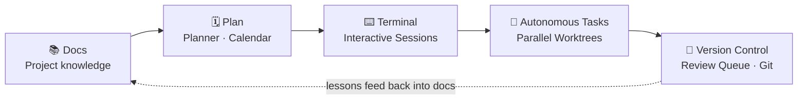

<div align="center">

<picture>
  <source media="(prefers-color-scheme: dark)" srcset="https://raw.githubusercontent.com/HyperAITeam/CLITrigger/main/src/client/public/logo.svg">
  <source media="(prefers-color-scheme: light)" srcset="https://raw.githubusercontent.com/HyperAITeam/CLITrigger/main/src/client/public/logo.svg">
  
</picture>

**Your AI Development Command Center**

*AI agents code overnight in parallel git worktrees — you review the diffs over coffee.*

<p align="center">
  <a href="https://github.com/HyperAITeam/CLITrigger/blob/main/README.md">English</a> ·
  <a href="https://github.com/HyperAITeam/CLITrigger/blob/main/README_KR.md">한국어</a>
</p>

[](LICENSE)
[](https://www.npmjs.com/package/clitrigger)
[](https://www.npmjs.com/package/clitrigger)
[](https://www.npmjs.com/package/clitrigger)
[](https://nodejs.org)
[](https://www.typescriptlang.org)
[](https://react.dev)
[](https://github.com/HyperAITeam/CLITrigger/stargazers)

<br>


<br><br>

```bash
npm i -g clitrigger && clitrigger
```

**Or download the desktop app** — no Node.js needed: **[Windows `.exe` · macOS `.dmg` · Linux `.AppImage`](https://github.com/HyperAITeam/CLITrigger/releases/latest)**

**Up and running in 60 seconds** — open `http://localhost:3000`, set a password, add a project, write TODOs, hit Start.

</div>

---

> ### Docs → Plan → Terminal → Autonomous Tasks → Version Control. One pipeline.
>
> The five stages of a development cycle scattered across five tools is today's real bottleneck. CLITrigger connects them in a single app — build project knowledge in **Docs**, shape it into a plan with the **planner & calendar**, refine it live in **terminal sessions**, then let multiple AI CLIs (**Claude Code · Antigravity · Codex**) **execute autonomously in parallel**, each in its own isolated git worktree — and land the results through the **review queue and built-in Git client**.
>
> While you sleep (or focus elsewhere), they burn through your token quota. Next morning you sit down, review the stack of diffs, and **accept / reject / merge**.
>
> **No context leaks between stages — the intent you captured in docs flows all the way to the merge.**



<div align="center">
  
  <p><em>AI CLIs working simultaneously across isolated git worktrees</em></p>
</div>

---

## Why CLITrigger?

**Running Claude Code in your terminal, you drive one agent at a time and babysit it.** CLITrigger fans that out: many agents, each in its own isolated worktree, running while you're away — and a single place to plan the work and review every diff when they're done.

Boris Cherny, creator of Claude Code, emphasizes **parallelism** as the key to AI-assisted development. Waiting for one task to finish before starting the next is the new bottleneck.

At the same time, most AI services have **rate limits** — you can burn through your daily quota by noon and be stuck waiting until midnight.

And as AI writes more of the code, the developer's real job becomes **capturing intent and reviewing output** — which falls apart the moment your context is scattered across sticky notes, terminals, and a dozen browser tabs.

CLITrigger solves all three:

- **Right now** — Multiple tasks run in isolated git worktrees, with Claude / Antigravity / Codex executing in parallel
- **Without hitting limits** — Schedule tasks for off-peak hours to make the most of your token quota
- **Without losing the thread** — The intent captured in your docs flows through plan → terminal → autonomous tasks → merge as one pipeline. No sticky notes, no twelve browser tabs
- **Better output** — Multiple AI agents debate and review before implementation, producing higher-quality results than a single AI working alone

---

## Features

The features follow the five pipeline stages — **📚 Docs → 🗓 Plan → ⌨️ Terminal → 🤖 Autonomous Tasks → 🔀 Version Control** — plus the supporting features underneath. Each feature below has a full guide in the **[Wiki](https://github.com/HyperAITeam/CLITrigger/wiki)** (↗).

### 📚 1. Docs — build the knowledge

#### Docs (File-based Knowledge)
A per-project Obsidian-style knowledge base with a `[[wikilink]]` graph — inject any file into a prompt, CLI-agnostically. What accumulates here is the input to the whole pipeline. [↗](https://github.com/HyperAITeam/CLITrigger/wiki/Plan-&-Organize#vault)

<div align="center">
  
  <p><em>The Docs tab — browse project markdown with inline preview and a force-directed wikilink graph, then selectively inject files into prompts</em></p>
</div>

### 🗓 2. Plan — capture the intent

#### My Schedule
One personal calendar overlaying your memos, every project's schedules, planner due dates, and assigned Jira issues. [↗](https://github.com/HyperAITeam/CLITrigger/wiki/Plan-&-Organize#my-schedule)

<div align="center">
  
  <p><em>One calendar overlaying personal memos, cross-project schedules, planner due dates, and assigned Jira issues</em></p>
</div>

#### Planner
A lightweight task planner — capture ideas, then convert any item into a TODO, schedule, or session; Markdown import/export. What you plan here becomes the execution unit of the next stage. [↗](https://github.com/HyperAITeam/CLITrigger/wiki/Plan-&-Organize#planner)

<div align="center">
  
  <p><em>Inline editing, color-coded tags, image attachments, and one-click conversion to TODOs or schedules</em></p>
</div>

### ⌨️ 3. Terminal — refine it with AI

#### Interactive Sessions
Long-lived CLI sessions in floating windows with VS Code-style docking, pop-out, and real xterm.js terminals — the human-in-the-loop stage before handing work off to automation. [↗](https://github.com/HyperAITeam/CLITrigger/wiki/Delegate-to-AI#interactive-sessions)

<div align="center">
  
  <p><em>Claude, Antigravity, and Codex sessions docked side-by-side via VS Code-style window grouping — each running in its own worktree branch</em></p>
</div>

### 🤖 4. Autonomous Tasks — AI executes in parallel

#### Parallel Worktree Execution (Tasks)
Every TODO runs in its own git worktree with Claude / Antigravity / Codex in parallel, plus dependency chains and merge control. [↗](https://github.com/HyperAITeam/CLITrigger/wiki/Delegate-to-AI#parallel-worktree-execution)

#### Multi-Agent Discussion
Architect / developer / reviewer agents debate before implementing, then commit code or send action items to the planner. [↗](https://github.com/HyperAITeam/CLITrigger/wiki/Delegate-to-AI#multi-agent-discussion)

<div align="center">
  
  <p><em>Multiple AI agents with different roles debating in the Discussion view</em></p>
</div>

#### Scheduled Execution
Run tasks on cron or one-off schedules, with auto-retry at the exact rate-limit reset time. [↗](https://github.com/HyperAITeam/CLITrigger/wiki/Delegate-to-AI#scheduled-execution)

<div align="center">
  
  <p><em>Cron-based recurring and one-time scheduled task execution</em></p>
</div>

#### Multi-CLI & Sandbox Mode
Pick Claude / Antigravity / Codex per project, TODO, or agent; strict sandbox confines file access to the worktree. [↗](https://github.com/HyperAITeam/CLITrigger/wiki/Delegate-to-AI#multi-cli--sandbox-mode)

### 🔀 5. Version Control — review and land it

#### Morning Review Queue
Triage every overnight TODO across projects in one keyboard-driven card stack — navigate, merge, or discard in a keypress. [↗](https://github.com/HyperAITeam/CLITrigger/wiki/Review-&-Ship#morning-review-queue)

#### Built-in Git Client
A Fork / SourceTree-style Git client in the browser — stage, commit, push, and manage branches and diffs. This is where AI output lands in your history, closing the pipeline. [↗](https://github.com/HyperAITeam/CLITrigger/wiki/Review-&-Ship#built-in-git-client)

<div align="center">
  
  <p><em>Commit graph, branch actions, file diffs — all in the browser</em></p>
</div>

### 🧰 Supporting the pipeline

#### Analytics
Per-project cost and execution stats — by CLI, by status, and over time. [↗](https://github.com/HyperAITeam/CLITrigger/wiki/Review-&-Ship#analytics)

<div align="center">
  
  <p><em>Cost and token usage broken down by CLI, status, and over time</em></p>
</div>

#### Live Logs (Chat & Raw)
Real-time WebSocket log streaming in Chat (markdown) or Raw (terminal) mode. [↗](https://github.com/HyperAITeam/CLITrigger/wiki/Review-&-Ship#live-logs)

#### Favorites Launcher
One-click launcher for your frequent external tools (executables, commands, URLs) from the sidebar. [↗](https://github.com/HyperAITeam/CLITrigger/wiki/Plan-&-Organize#favorites-launcher)

#### Remote Access
Reach CLITrigger from anywhere via Cloudflare Tunnel, with completion notifications and custom-domain routing. [↗](https://github.com/HyperAITeam/CLITrigger/wiki/Remote-Access)

---

## Tech Stack

| Layer | Tech |
|-------|------|
| Backend | Node.js · Express · TypeScript · SQLite · WebSocket |
| Frontend | React 18 · Vite · Tailwind CSS · Recharts |
| AI CLIs | Claude · Antigravity · Codex (Adapter Pattern) |
| Git | simple-git (worktree management) |
| Scheduling | node-cron |
| Terminal | node-pty (TTY support) · xterm.js (pixel-perfect rendering) |
| Remote Access | Cloudflare Tunnel (optional) |

---

## Quick Start

### Option A — Desktop App (recommended for end users)

Download the installer for your platform from the [latest GitHub release](https://github.com/HyperAITeam/CLITrigger/releases/latest):

- **Windows** — `CLITrigger-Setup-<version>.exe` (NSIS installer) or the portable `.exe`
- **macOS** — `CLITrigger-<version>.dmg` (Apple Silicon & Intel)
- **Linux** — `CLITrigger-<version>.AppImage`

The desktop app bundles Node.js and the native modules (`better-sqlite3`, `node-pty`, `cloudflared`), so no separate runtime install is needed. On first launch a setup screen appears in the embedded browser — pick a password there and you're in. External sharing (Cloudflare tunnel) stays paused until setup completes, so the first user is guaranteed to be you.

### Option B — npm (recommended for developers)

```bash
# Install
npm i -g clitrigger
clitrigger

# Upgrade to the latest version
npm i -g clitrigger@latest
# Check current version: clitrigger --version
```

On first run the server starts immediately. Open `http://localhost:3000` → set a password on the welcome screen → register a project → write TODOs → click Start. Change the password later via Settings → Account in the web UI.

CLITrigger also prints a one-line `Update available: <new> -> npm i -g clitrigger@latest` hint at startup whenever a newer version is on npm — no auto-update, you decide when to upgrade.

```bash
# Change settings
clitrigger config port 8080    # Change port
clitrigger config tunnel on    # Enable Cloudflare tunnel for external sharing
```

> **Prerequisites**: Node.js 22+ (use an **LTS** release), Git, at least one AI CLI (Claude / Antigravity / Codex)
>
> **Supported Platforms**: Windows · macOS · Linux — all core code is cross-platform compatible.
> Prefer an LTS (even-numbered) Node.js. A brand-new major (e.g. an odd/just-released version) may not have prebuilt native binaries yet, which forces a source build requiring a C++ toolchain (Visual Studio Build Tools on Windows, `xcode-select --install` on macOS).

### Run from Source (for development)

<details>
<summary>Click to expand</summary>

```bash
# 1. Clone & install
git clone https://github.com/HyperAITeam/CLITrigger.git
cd CLITrigger
npm install
cd src/client && npm install && cd ../..

# 2. Configure environment
cp .env.example .env
# AUTH_PASSWORD is optional — leave it blank and the dev server will show the
# setup screen on first browser load. Set it only if you want to skip setup.

# 3. Run
npm run dev
```

Open `http://localhost:5173`.

#### Windows One-Click Scripts

Double-click any bat file in `scripts/` — no terminal needed.

| File | Action |
|------|--------|
| `install.bat` | Install dependencies (first time) |
| `dev.bat` | Start development mode |
| `build.bat` | Build project |
| `start.bat` | Start production server |
| `start-tunnel.bat` | Start with Cloudflare Tunnel |
| `test.bat` | Run all tests |

#### macOS / Linux

`npm run` commands work identically on all platforms. Use the terminal instead of `.bat` scripts.

```bash
npm run dev        # Development mode
npm run build      # Build
npm run start      # Production server
npm test           # Run tests
```

</details>

### Remote Access (Cloudflare Tunnel)

```bash
# Install cloudflared
winget install cloudflare.cloudflared    # Windows
brew install cloudflared                  # macOS

# Set TUNNEL_ENABLED=true in .env, then:
npm run start:tunnel
# → Outputs https://xxxx.trycloudflare.com in the console
```

#### Route a named tunnel through your own domain (optional)

To avoid the "dangerous site" browser warnings on `*.trycloudflare.com` / `*.cfargotunnel.com`, point a named tunnel at your own domain. Either use the sidebar ⚙ → Tunnel settings modal (Tunnel Name + Custom Hostname), or the CLI:

```bash
clitrigger config tunnel hostname app.your-domain.com
cloudflared tunnel route dns <tunnel-name> app.your-domain.com   # one-time
```

The displayed URL becomes `https://app.your-domain.com` and reputation tracks your domain.

---

## Documentation

📖 **The full manual lives in the [Wiki](https://github.com/HyperAITeam/CLITrigger/wiki)** — installation, every feature guide, and remote access.

| Doc | Content |
|-----|---------|
| [Wiki](https://github.com/HyperAITeam/CLITrigger/wiki) | Detailed feature guides and usage |
| [SETUP.md](docs/SETUP.md) | Detailed installation and usage guide (한국어) |
| [changelog/](docs/changelog/README.md) | Version history (per-date entries by month) |
| [CICD.md](docs/CICD.md) | GitHub Actions CI/CD setup |
| [TESTING.md](docs/TESTING.md) | Testing guide |

---

## Star & Join Us

If CLITrigger saves you time, please [**give us a star**](https://github.com/HyperAITeam/CLITrigger) — it genuinely helps the project reach more developers.

Want to help shape what comes next? We're actively looking for contributors:

- **File an issue** — bug reports, feature requests, and rough ideas all welcome at [Issues](https://github.com/HyperAITeam/CLITrigger/issues)
- **Open a PR** — start with [`good first issue`](https://github.com/HyperAITeam/CLITrigger/issues?q=is%3Aissue+is%3Aopen+label%3A%22good+first+issue%22) labels, or pick anything that itches you
- **Share what you built** — drop your worktree workflows, custom plugins, or productivity tips in [Discussions](https://github.com/HyperAITeam/CLITrigger/discussions)

Every star, issue, and PR moves this faster. Thank you 🙏

---

## Contributors

Thanks to everyone who has contributed to CLITrigger!

<a href="https://github.com/HyperAITeam/CLITrigger/graphs/contributors">
  
</a>

---

## Star History

<a href="https://www.star-history.com/?type=date&repos=HyperAITeam%2FCLITrigger">
  <picture>
    <source media="(prefers-color-scheme: dark)" srcset="https://api.star-history.com/chart?repos=HyperAITeam/CLITrigger&type=date&theme=dark&legend=top-left&sealed_token=R33OVQ1e-AI8ctoPaGe7ewkSmvN8Gu6hjU17eN9yHxckmgmY1pKvDR0YS3EfDfyFavnkF5BMNNUrMGZamuP7ietWibyDuGoDy_ybdNuzDCMmursd6di3qZwAfwxle8hIWF3a-uP51KiD_cqthhcgCkZk3kgiYz8DA6K-du4SYqSAD9Nhas8olSX2Ax1R" />
    <source media="(prefers-color-scheme: light)" srcset="https://api.star-history.com/chart?repos=HyperAITeam/CLITrigger&type=date&legend=top-left&sealed_token=R33OVQ1e-AI8ctoPaGe7ewkSmvN8Gu6hjU17eN9yHxckmgmY1pKvDR0YS3EfDfyFavnkF5BMNNUrMGZamuP7ietWibyDuGoDy_ybdNuzDCMmursd6di3qZwAfwxle8hIWF3a-uP51KiD_cqthhcgCkZk3kgiYz8DA6K-du4SYqSAD9Nhas8olSX2Ax1R" />
    
  </picture>
</a>

---

## ☕ Buy Me a Coffee

If CLITrigger saves you time, consider buying me a coffee!

<div align="center">

[](https://buymeacoffee.com/osgoodyz)

</div>

---

## License

[MIT](LICENSE) — Free to use, modify, and distribute.
