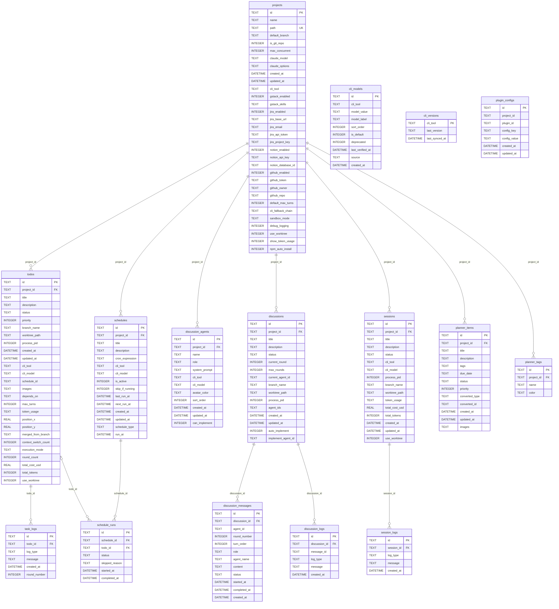

# Database ERD

<!-- AUTO-GENERATED FROM src/server/db/schema.ts — DO NOT EDIT MANUALLY -->
<!-- To regenerate: npm run docs:erd -->
<!-- CI verifies this file is in sync: npm run docs:erd:check -->

Source: `src/server/db/schema.ts`
Stats: 16 tables, 191 columns, 13 foreign keys

## Diagram

## Domain Groupings

- **Todo Execution**: `projects` → `todos` → `task_logs`
- **Scheduling**: `projects` → `schedules` → `schedule_runs` → `todos`
- **Discussion**: `projects` → `discussion_agents` / `discussions` → `discussion_messages` / `discussion_logs`
- **Session**: `projects` → `sessions` → `session_logs`
- **Planner**: `projects` → `planner_items` / `planner_tags`
- **Plugin Config**: `projects` → `plugin_configs` (implicit FK, see notes)
- **CLI Registry**: `cli_models`, `cli_versions` (standalone)

## Notes

- `plugin_configs.project_id` has no SQL `REFERENCES` declaration but conceptually points to `projects.id`. It is a generic key-value table used by the plugin system.
- Relationships: `||--o{` = parent required (ON DELETE CASCADE), `|o--o{` = parent optional (ON DELETE SET NULL).
- Columns added via `ALTER TABLE` migrations in `schema.ts` are merged into their parent tables in declaration order.
- Composite `UNIQUE(...)` constraints are omitted from the diagram; see `schema.ts` for the full definition.
